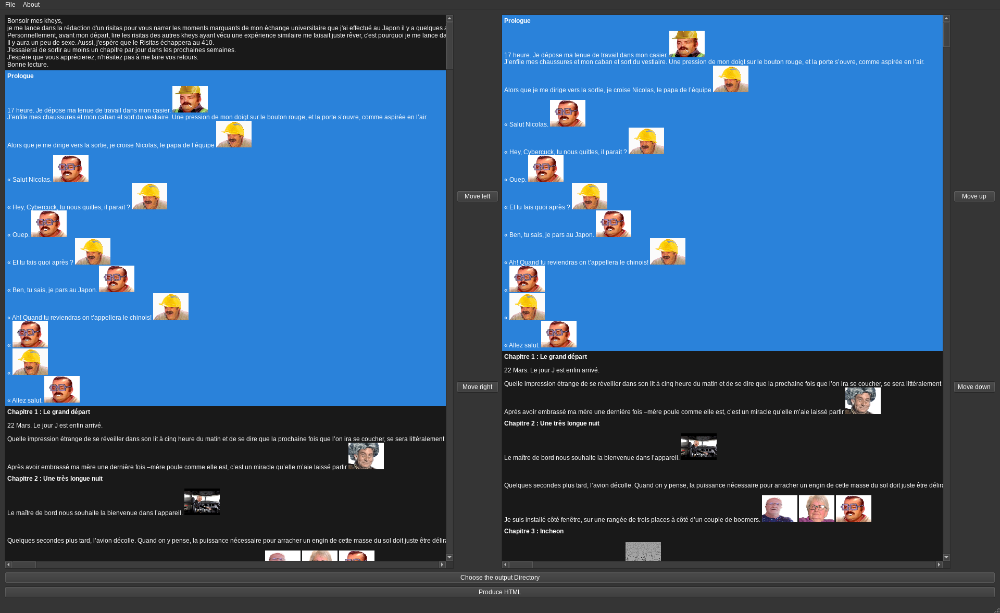

# Risicompare

Ce projet dépend de <https://github.com/vichelisdelapaz/risiparse>



# Utilisation

Dans un premier temps télécharger le/les risitas avec l\'approche
automatique

``` example
risiparse --download-images --no-pdf -l <links>
```

Puis télécharger tous les posts de l\'auteur (à noter que la commande ci-dessous n'est pas nécessaire
pour risific car tous les posts là-bas sont de l'auteur, ou si l'approche automatique à déjà tous les chapitres)

``` example
risiparse --all-posts --download-images --no-pdf
```

Une fois que c\'est fait on peut lancer risicompare

``` example
risicompare
```

Une fois dans le GUI, il faudra cliquer sur File en haut à gauche, puis
sur bulk File et Identifier File.

Bulk file correspond à la fenêtre de gauche, c\'est la fenêtre qui est
censé contenir tous les posts de l\'auteur. Cette fenêtre est ignorée
pour la création du nouveau html.

Identifier file correspond quant à lui à la fenêtre de droite, c\'est la
fenêtre qui contient tous les posts rapportés par l\'approche
automatique, le nouveau html sera créé à partir de cette fenêtre.

Aussi dans le cas où l'approche automatique contient tous les chapitres, et qu'il faut
juste en trier certains il n'est pas nécessaire de charger un fichier pour la fenêtre de gauche.
Juste charger le fichier qui contient tout dans la fenêtre de droite. Et faire le tri là.

Une fois que les modifications sont faites il faudra juste enregistrer le fichier html dans un
répertoire contenant risitas-html, et si vous utilisez la base de données (oui par défaut)
il faudrait remplacer l'html du risitas cible par celui qui vient d'être créé, comme ça lorsqu'il y'a
des mises à jour pour le risitas, ça sera ajouté automatiquement dans le fichier que vous avez modifié
et le tout dans le bon ordre/sans partie manquante.

## Autres options

Pour chaque options après les avoir règlées, il faut resélectionner les fichiers dans identifier/bulk file
pour qu'elles prennent effet.

-   Show images : Si l\'option est cochée les images seront affichées(si
    désactivée il y\'aura un placeholder pour image manquante)
    il y\'a une perte notable de performance quand les images sont affichés en gros plan, cette
	perte est notamment dûe aux images trop grandes dont risiparse a enlevé la limite
	(ce qui arrive quand risiparse "pense" que le script est un chapitre, mais c'est
	peut-être juste une photo de voyage par exemple), et qui prend beaucoup de place.

	Donc si c'est juste des stickers à taille normale devrait pas y'avoir ce souci là.

-   Nombre de paragraphes : Le nombre de paragraphes à afficher par
    message, par défaut 3, afficher moins de paragraphes aide au niveau
    des performances.

## Opérations

CTRL + V : Défiler les posts des fenêtres vers le bas en même temps

ALT + V : Défiler les posts des fenêtres vers le haut en même temps

Move left, CTRL + FLECHE GAUCHE : Bouge le message sélectionné dans la
fenêtre Identifier dans la fenêtre Bulk, équivalent à le supprimer

Move right, CTRL + FLECHE DROITE : Bouger le message sélectionné dans la
fenêtre Bulk dans la fênetre Identifier, équivalent à ajouter un message

Move up, CTRL + FLECHE DU HAUT : Uniquement dans la fenêtre Identifier,
bouge le message sélectionné vers le haut

Move down, CTRL + FLECHE DU BAS : Uniquement dans la fenêtre Identifier,
bouge le message sélectionné vers le bas

Quit, CTRL + Q : Quitter l\'application

Help, CTRL + H : Afficher l\'aide

Write HTML to..., CTRL + O : Choisir la destination du fichier qui sera
créé

Produce HTML, CTRL + D : Ecrire le nouveau fichier vers la destination
choisie

## Déplacements

Possibilité de se déplacer de message en message avec les flèches du
clavier.

Possibilité de sélectionner un bouton/fenêtre avec la souris ou le
clavier via tab/maj-tab

## Fichier créé

Une fois que le fichier a été créé vers la destination choisie, il ne
reste plus qu\'a le déplacer dans le risitas-html de risiparse(ou juste
le créer directement dans risitas-html), ou d\'une autre destination que
vous avez choisi.

Ensuite il faudra juste lancer

``` example
risiparse --no-download
```

Ou

``` example
risiparse --no-download -o <destination contenant risitas-html>
```

Pour avoir le pdf sans posts hors-sujet et/ou avec les posts
manqués par l\'approche automatique.
